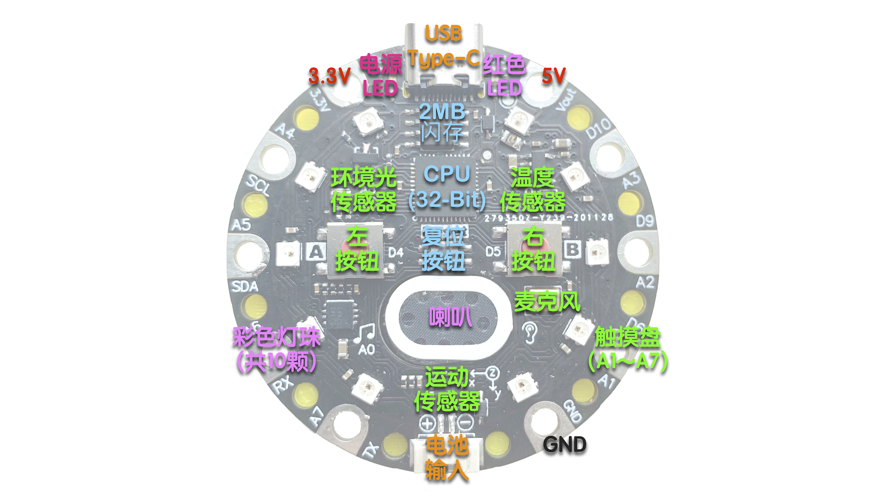

====================
编程圆简介
====================

-----------------------------------------------

现在我们来认识编程圆(HiiBot Circle)。如上图所示，编程圆使用32-bit ARM Cortex-M0+微控制器和片外2MB高速闪存，
微控制器的时钟频率达48MHz，不仅能够高速地执行用户程序，还允许用户存储音频、传感器信息等资源文件高达2MB。

编程圆使用USB Type-C与宿主计算机连接。与宿主计算机连接后，编程圆被映射成磁盘，用户只需要通过拖放或复制-粘贴文件的形式即可下载程序。
除了一根Type-C接口的USB数据线之外，用户无需任何特殊的硬件设备即可更新编程圆的固件和用户程序。

编程圆带有一个1.25mm间距的电池输入接口，允许3~6V电池输入(即2~4节干电池组成的电池盒或单节3.7V锂电池)。
仅5cm直径的编程圆和电池一起以极小的体积可嵌入到用户的作品中。

具有丰富的拟人化传感器是编程圆的特色之一，每种传感器都可以与人体的某个功能器官对应。左、右按钮，7个触摸盘输入、环境温度传感器可类比为人体触觉器官(👋)；
环境光(和环境颜色)传感器可类比为人体视觉器官(👀)；数字麦克风可类比为人体听觉器官(👂)；运动传感器可类比为人体前庭耳蜗器官(🏊‍♀️)。

可编程的红色LED是编程圆上最简单的输出部件。编程圆的红色LED支持亮、灭、闪烁、亮度调节等控制效果。编程圆带有一个1W的微型喇叭和音频放大器，
允许用户编程播放音调和Wave音频文件等。用户可以使用编程圆的10颗彩色灯珠产生动感的彩光。

